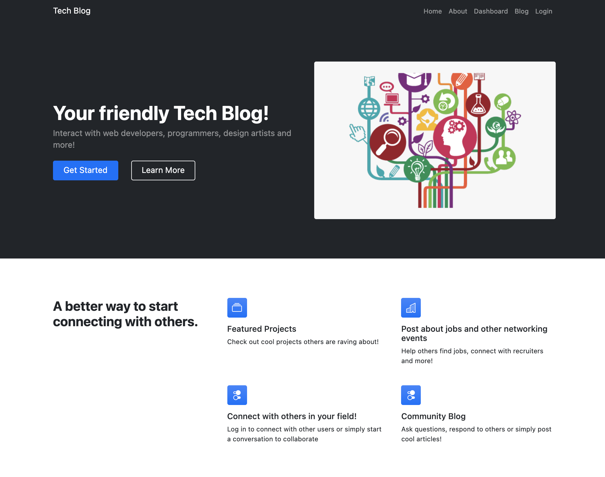
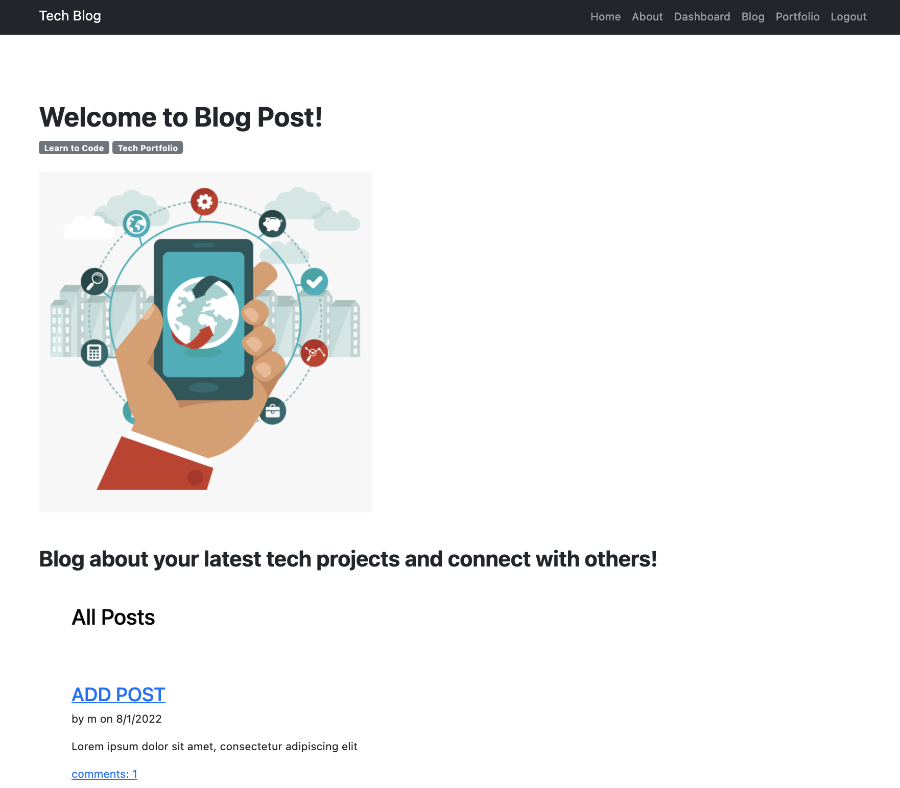
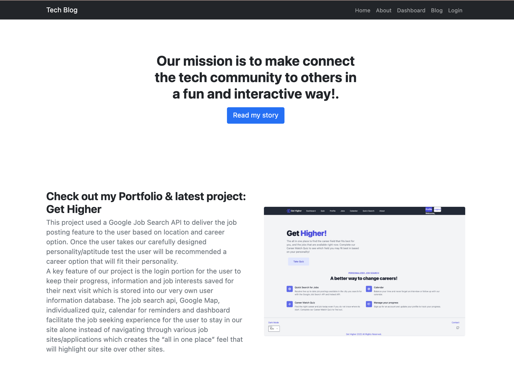
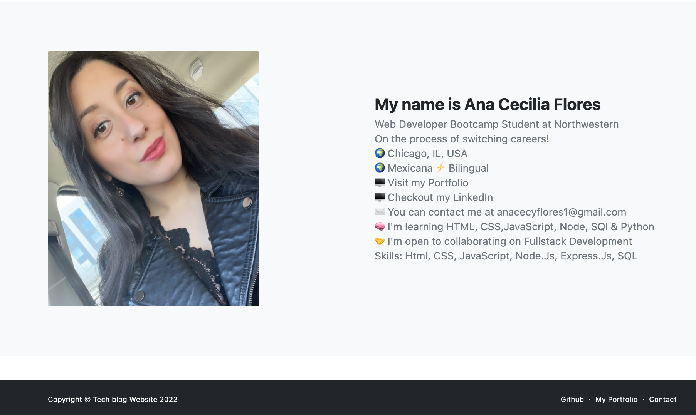
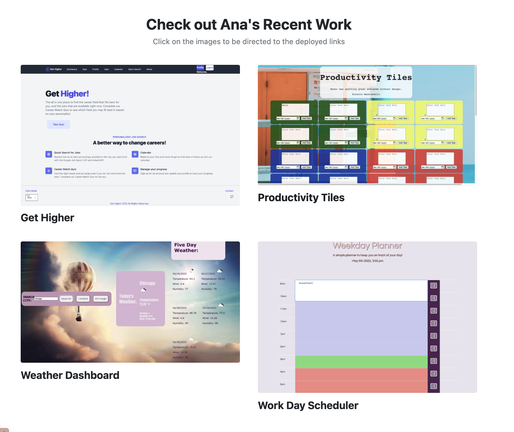

# Tech Blog


<br>
<a href="https://techno-blogger.herokuapp.com/login/">Heroku Deployment</a>
<br><br>

## Table of Contents

- [Description](#description)
- [Installation](#installation)
- [Usage](#usage)
- [Screenshots](#screenshots)
- [Technologies Used](#technologies-used)
- [Credits](#credits)
- [Questions](#questions)
- [License](#license)

<br>

## Description
Our mission is to make connect the tech community to others in a fun and interactive way!
<br>
Interact with web developers, programmers, design artists and more!
<br>
post about your latest blogs, connect with other users, in a login- based tech blog app where you can create, update and save your postsfor otehr users to see. You can also comment on other posts.
<br>

This app was created using Bootstrap Template and adde MVC functionalities to store user's login information, comments and posts to our SQL database.

## Installation

[Node.js](https://nodejs.org/en/) installation is required. Clone repo and follow usage commands.

<br>

## Usage

Install dependencies:

```
npm install
```

<br>

Start the application/run the port:

```
node server
```

<br>

Optional- Run the seed file for starter content

```
run npm seed
```

<br>

## Screenshots

<br>

<br>

<br>

<br>
<br>

<br>
<br>

<br>

## Technologies Used

- [Bootstrap](https://startbootstrap.com/template/modern-business)
- [node.js](https://nodejs.org/en/)
- [nodemon](https://www.npmjs.com/package/nodemon)
- [bcrypt](https://www.npmjs.com/package/bcrypt)
- [connect-session-sequelize](https://www.npmjs.com/package/connect-session-sequelize)
- [dotenv](https://www.npmjs.com/package/dotenv)
- [express](https://expressjs.com/)
- [express-handlebars](https://www.npmjs.com/package/express-handlebars)
- [express-session](https://www.npmjs.com/package/express-session)
- [mysql2](https://www.npmjs.com/package/mysql2)
- [sequelize](https://sequelize.org/)

<br>

## Credits

bootstrap name: startbootstrap-modern-business <br>
version": "5.0.6"

## Questions

Contact me here:

  <a href="mailto: anacecyflores1@gmail.com">
  
  </a>

<br>

## License

MIT License

Copyright (c) 2022 Ana Cecy Flores

Licensed under the [MIT](LICENSE) license.
